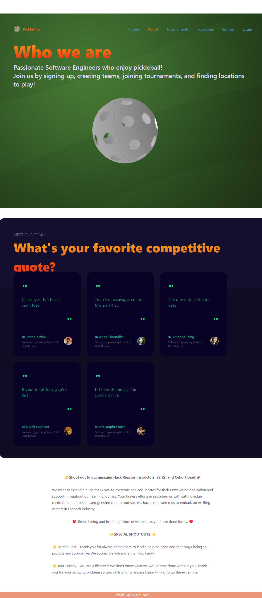

# Graphical Human Interface

---

## Home

This is the landing page when you first load the site.

---

# About

This page gives an overview of the developers.

---

# Signup

Users can signup and create an account on this page providing:

- Username
- Password
- Email
- Birthdate
- First Name
- Last Name

.png>)

---

# Login

If a user already has an account they can login on this page providing:

- Username
- Password

.png>)

---

# Profile

A user can see their profile here. They have the ability to update/edit their info as well as delete their account.

.png>)

---

# Players

A user can see a list of all players on the site. They can also click on the profiles and see some of the details for each player.

.png>)

---

# Teams

A user can see a list of all teams on the site. They can create a team here as well as see the details for each team.

-1.png>)

---

# Create Team

A user can create a team as well as signup for a tournament here. This team data will then populate on the tournament details page to show the teams signed up for the tournament. To create a team a user provides:

- Team Name
- Category
- Age Bracket
- Number of Players
- Player One
- Player Two (Optional)
- Tournament

.png>)
-1.png>)

---

# Team Details

A user can see the details of a team here. If they are on the team they can edit the details of that team as well as delete there team if they are player 1.

.png>)

---

# Tournaments

A user can see a list of all tournaments on the site here.

.png>)

---

# Create Tournament

A user who has admin status can create a tournament using this form. The button to get to this form is on the tournament list page.To create a tournament an admin user provides:

- Name
- Start Date
- End Date
- Category
- Location
- Description
- Maximum Teams
- Reached Maximum

.png>)

---

# Tournament Details

A user can see the details for a tournament here. If they are an admin they can edit the details as well as delete the tournament. The teams that are signed up for the tournament are displayed at the bottom.

-1.png>)

---

# Locations

A user can see a list of all of the locations where they can play pickleball.

.png>)

---

# Create Location Form

A user with admin status can create new locations using this form. To create a location an admin user provides:

- Name
- Address
- Phone Number
- Description
- Surface
- Picture URL
- Number of Indoor Courts
- Number of Outdoor Courts
- Locker Rooms
- Restrooms
- Water
- Lighted Courts
- Wheelchair Accessible

.png>)

---

# Location Details

A user can clisck on a location and see the details for this location. If they are an admin they can edit the details as well as delete the location. This page utilizes the Google Maps API and displays the address provided for the location.

.png>)
