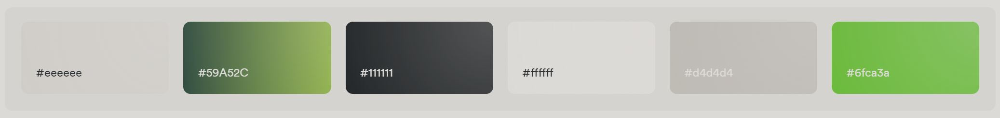

# PicklePlay

<div style="text-align: center;">
    
</div>

## Description

Pickleball is one of the fastest growing sports in America, with over 4.8 million players and counting. However, it can be difficult for enthusiasts to find fellow players and exciting tournaments. That's why we created PicklePlay - a small online community for pickleball players. PicklePlay makes it easy to connect with fellow players in your area, organize and join teams and tournaments, and even scout out new courts!

## Team Members

<div style="text-align: center;">
    Amanda Taing    ⭐    Anna Thorndike    ⭐    Christopher Bush    ⭐    Derek Snediker    ⭐    John Gordon
  <br/>
  <br/>
  
</div>

---

## Table of Contents

1. First item (Description)
2. Second item (Team Members)
3. Third item (Overview)
   1. Indented item
   2. Indented item
4. Fourth item (Design)
5. Fifth item (Installation)
6. Sixth item ()
7. Seventh item ()
8. Eight item ()
9. Ninth item ()
10. Tenth item ()

---

## Overview

Words words words


---

## Design

Words words words

UX Design

- Interaction Design
- Wireframes & Prototypes
  - Figma
  - ?UIZARD
- Information Architect
- User Research
- Scenarious

UI Design

- Visual Design
- Colors
  

- Graphic Designer
- Layouts
- Typography

<details><summary><strong>Wire-Frame Diagrams</strong></summary>
    
</details>

<details><summary><strong>Context Map</strong></summary>
    
</details>

<details><summary><strong>Route Tree Diagram</strong></summary>
    
</details>


---

## Installation

1. Open up your terminal to the desired directory on your local computer

2. Fork the repository

3. Clone the repository

```
git clone https://gitlab.com/gitjaacd/pickle-play.git
```

4. Change your working directory to the project's directory

```
cd pickle-play
```

5. Open up Docker Desktop and run the following commands in your terminal:

```
docker-compose down --remove-orphans
docker network prune # Answer Y
docker container prune # Answer Y
docker volume prune # Answer Y
docker image prune # Answer Y
```

6. Go back to docker desktop and delete all images, containers, and volumes

7. Run the following to build your repo. This will take a few minutes as it needs to download some dependencies.

```
docker volume create postres-data
docker-compose build
docker-compose up
```

8. All of your containers should be up and you should be able to go to the following:

- [localhost:8000/docs](http://localhost:8000/docs) —> api docs page
- [localhost:3000](http://localhost:3000) → frontend to your project


---

## API Documentation

Words words words

#### Example Table

| Method | URL                                   | Action                   | View       |
| ------ | ------------------------------------- | ------------------------ | ---------- |
| GET    | `http://localhost:8100/api/***/`      | List all \*\*\*          | `api_***s` |
| POST   | `http://localhost:8100/api/***/`      | Create a \*\*\*          | `api_***s` |
| GET    | `http://localhost:8100/api/***/<id>/` | Show a \*\*\*'s details  | `api_***`  |
| PUT    | `http://localhost:8100/api/***/<id>/` | Update a \*\*\*          | `api_***`  |
| PATCH  | `http://localhost:8100/api/***/<id>/` | Update a specific \*\*\* | `api_***`  |
| DELETE | `http://localhost:8100/api/***/<id>/` | Delete a \*\*\*          | `api_***`  |


---

## Deployement

Project is deployed to Caprover (BE, DB) & GitLab-pages (FE)

- Make sure this project is in a group. If it isn't, stop now and move it to a GitLab group.
- Remove the fork relationship: In GitLab go to:
  `Settings > General > Advanced > Clear Fork Relationhsip with Original Project`
- Add these GitLab CI/CD variables:
  `PUBLIC_URL: this is your gitlab pages URL`
  `REACT_APP_API_HOST: enter "blank" for now`
- Our GitLab project URL
  `https://gitlab.com/gitjaacd/pickle_play` or `https://gitlab.com/gitjaacd/pickle-play`
- Our GitLab pages URL
  `https://gitjaacd.gitlab.io/pickle_play` or `https://gitjaacd.gitlab.io/pickle-play`
- Initalize CapRover (Attain IP address and domain from an instructor, follow steps in the CD Cookbook in Learn)
- Merge a change into main to kick off the inital deploy. Once the build pipeline finishes you should be able to see an "under construction" page on your GitLab pages site.


---

## Issues

- GitLab issue board is setup and in use (or project management tool of choice)

---

## Journals

- Journals

---

# Thank You!

<div style="text-align: center;">

📣 Shout out to our amazing Hack Reactor Instructors, SEIRs, and Cohort Lead! 🎉

We want to extend a huge thank you to everyone at Hack Reactor for their unwavering dedication and support throughout our learning journey. Your tireless efforts in providing us with cutting-edge curriculum, mentorship, and genuine care for our success have empowered us to embark on exciting careers in the tech industry.

❤️ Keep shining and inspiring future developers as you have done for us. You truly are the backbone of our success! ❤️


</div>

---

## Resources

- [Markdown Guide](https://www.markdownguide.org/basic-syntax/#:~:text=Line%20Breaks,spaces%2C%20and%20then%20type%20return.) → Basic Syntax: The Markdown elements outlined in the original design document.
- [Pudgy-Penguin GIFs](https://giphy.com/search/pudgy-penguin) → Visual fun 😊
- [FastAPI Documentation](https://fastapi.tiangolo.com/)
- [PostgreSQL Documentation](https://www.postgresql.org/)
- [Pydantic Documentation](https://docs.pydantic.dev/latest/)
- [OpenAPI Initiative](https://www.openapis.org/)
- [React](https://react.dev/)
