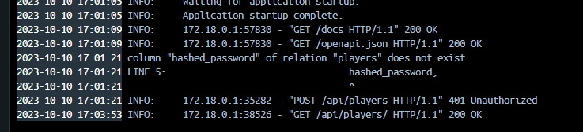
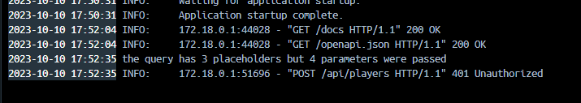
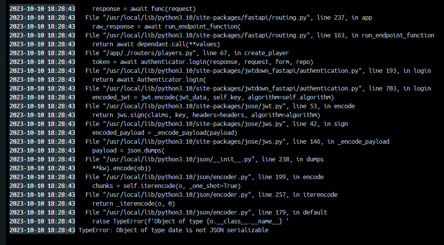
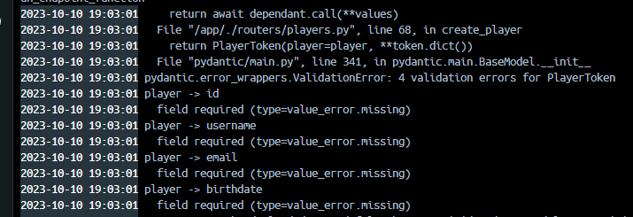
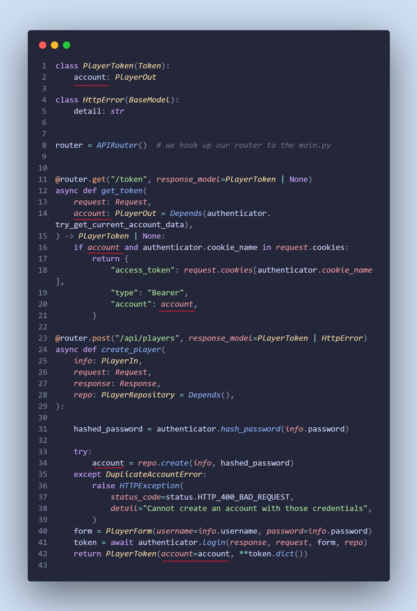

# PicklePlay - Amanda's Development Journal

## Team Members:

- Amanda Taing
- Anna Thorndike
- Christopher Bush
- Derek Snediker
- John Gordon

***

## Week 5

## Thursday October 26, 2023

### Today I worked on:

* I tried to help John fix his team details page where it would show too many players under player 2 (should be one). This was because he was trying to fetch player 2 data using player 2's first and last name. Apparently it was not working if he used id. This is not ideal since first and last name are optional fields, so multiple users can have empty strings. It's also not ideal because people can have the same name (but we will account for that during stretch goals).
    * We worked around this by making first and last name required fields on the signup form on the front end. We didn't want to change migration tables this late in the game to make first and last name required fields (but maybe we will next week)

* Fixed an issue where the profile navbar was not showing on the profile pages. This was because of the stylesheets I had imported. To fix this, I removed those stylesheets and just figured out how to write the css classes on my own!

* After all the above, we stopped coding to focus on front end deployment. There were lots of errors at first because of our 3D models, but luckily Bart was able to help us after a few hours of debugging! He found that gitlab didn't support the .glb files that the 3D models needed, so he had Anna put them into static folders in our api directory (backend) and fetch them from the front end by calling localhost:8000 instead of localhost:3000. This did the trick and we were very happy to be done.

**AH-HA!💡**

* Figuring out how to get the navbar show using my own css!! I personally struggle more with css so this made me pretty happy.

***

## Wednesday October 25, 2023

### Today I worked on:

* list players component
* player detail page
* styled sign up and login pages
* frontend logout
* Helped teammates debug

I looked up tailwind css documentation on tables to help style this. I got each row to be clickable so that you can navigate to that player's profile page, which hides some information (such as phone number, emergency contact information)

Since first_name, last_name, and profile_picture are optional fields, not all users have them. It did not look nice to have nothing where their names/profile picture should be in the player list table, so I coded it such that if those fields are null, they would be set to a default image (pickleplay logo) and name (Pickle Player)

**AH-HA!💡**

* Discovering how to calculate age using the user's birthdate and current date! I was able to learn more about Date objects and methods

***

## Tuesday October 24, 2023

### Today I worked on:

* Fixed an issue where editing your profile would set the user's admin status to false if they were previously an admin
    * Editing your profile should now set the user's admin status to whatever it previously was
    * Right now, admins can only be created on the backend. Hope to change this during stretch goals
* Added a delete button to the profile page for users to delete their own account
    * Added a modal component to confirm deletion of the account

**AH-HA!💡**

* Finding the solution to the bug below
* Discovering how to make tailwind modals!

🪲 Editing profile would set user admin status to false

**\~Solution~**
* Changed create_player query to default admin status to false upon creation
* To make a user an admin, they'd have to update their account on the backend and set admin to true

***

## Monday October 23, 2023

### Today I worked on:

* Finished get all players unit test
* Finished edit profile component so logged in users can edit their profile information

For the edit profile page, I had the fields auto populate with the user's previous information so that they don't have to re-input their data that they don't need to change.

**AH-HA!💡**

* Finding out how to auto populate input fields (actually pretty simple, except for dropdowns)
* Finding the solution to the bug below

🪲 After a user saves their edit profile changes, the new data would not show up on the profile page

**\~Solution~**
* I found out that this was because the profile page was fetching account data from the /token fetch. This meant that it was getting data from the current state of the account when logging in. So any changes made after logging in would not reflect on the profile page.
* To fix this, I used the /token fetch to get the player id, then I passed that player id into the get_one_player fetch to get the most up to date user information

### Blockers

* The drop down selects do not autopopulate with the previous information, and I don't know how to fix it yet. Jordan also looked over it with us and is unsure why it does not work. Hopefully we can fix it during stretch goals week.

***

## Week 4

## Thursday October 19, 2023

### Today I worked on:

* We decided to change our foreign keys to have ON DELETE CASCADE instead of ON DELETE RESTRICT
* Continued working on frontend profile page component to have edit and delete buttons that lead to an edit profile form and a pop modal that confirms deletion (not done)

**AH-HA!💡**

* Even though I was copying an example tailwind component, I would add code line by line to see what changed on the frontend in order to better understand how to use tailwind css. By deleting certain things one by one, I was able to get a better

***

## Wednesday October 18, 2023

### Today I worked on:

* frontend profile page component

I did this by taking the account data of the current logged in user from the /token endpoint.

**AH-HA!💡**

* I found a nice [website]([https://tailwindcomponents.com/]) that has free tailwind css components that other devs have posted. I followed an example profile page component that I liked from this website

🪲 Getting account data using fetchWithCookies not working

**\~Solution~**
* This seemed to work for some people and not others and was causing a lot of issues. We decided to just fetch data from the /token endpoint instead and not use useToken

***

## Tuesday October 17, 2023

### Today I worked on:

* Added validation to create/update/delete team endpoints
* Added validation to create/update/delete tournament endpoints
* Added validation to create/update/delete location endpoints
* Front end authentication

Brian, from The Outriders group, helped me with front end authentication and I would not have gotten it done as quickly without him. There were a lot of ah-ha moments as we were looking through the front end documentation and seeing how things worked under the hood.

**AH-HA!💡**

* Just adding account data as a parameter to a route is enough for validation (gets token)
* Realizing I had to set REACT_APP_API_HOST to http://localhost:8000

***

## Monday October 16, 2023

### Today I worked on:

* Fixed update teams/tournaments endpoint so the user can update an existing team/tournament

### Bugs encountered 🐛🐞🐜 :

🪲 Updating a non-existing team would still return a successful response

**\~Solution~**
* John was using the object_in_to_out format for his return. I don't know why, but after hard coding the response instead of using that function, the endpoint worked as intended

***

## Week 3

## Friday October 13, 2023

### Today I worked on:

* Finished delete player
* Helped teammates debug

***

## Thursday October 12, 2023

### Today I worked on:

* Finished update player, get one player (authorized and unauthorized views)
* Fixed the create player endpoint

 I wrote get_one_player such that it checks whether the currently logged in user ID matches the ID of the player they want to see. If it is their own ID, the backend would return all their player information. If it is not their own ID (i.e., they are looking at someone else's profile), it will show more limited information.

**AH-HA!💡**
* Figured out how to add validation

### Bugs encountered 🐛🐞🐜 :

🪲 Create player was not inputting all the data into the backend. Optional fields were showing up as null even if we filled them out

**\~Solution~**
 The create player endpoint was previously not storing all the data from the inputs in the database. So I changed the sql in create player query to inclue and input all data, instead of just the required fields. This is so that all the information for each player shows when getting all players (previously, the optional fields were defaulted to null)
 [merge request]([https://gitlab.com/gitjaacd/pickle-play/-/merge_requests/28])

### References Used Today:
[jwtdown source code](https://gitlab.com/galvanize-inc/foss/jwtdown-fastapi/-/blob/main/jwtdown_fastapi/authentication.py?ref_type=heads)

[jwtdown documentation](https://jwtdown-fastapi.readthedocs.io/en/stable/intro.html?highlight=signing%20key#)
### Any Blockers:

N/A
### Tomorrow I'm working on:

Finishing player endpoints
### References for Tomorrow:

[FastAPI Notion Notes](https://www.notion.so/FastAPI-Notes-7fdb0637b0714b6bbf2833aec7540dc8?pvs=4)

***

## Wednesday October 11, 2023

### Today I worked on:

* backend auth

I completed backend authentication and had to edit the player migration table in order to do so. I also added error handling to the player endpoint.

**AH-HA!💡**

* Finally got a better grasp of how backend authentication works by looking at the source code and seeing how everthing connnects and works under the hood

**🎉 Celebrations 🎉**

* Finished backend auth!

### References Used Today:
[jwtdown source code](https://gitlab.com/galvanize-inc/foss/jwtdown-fastapi/-/blob/main/jwtdown_fastapi/authentication.py?ref_type=heads)

[jwtdown documentation](https://jwtdown-fastapi.readthedocs.io/en/stable/intro.html?highlight=signing%20key#)
### Any Blockers:

N/A
### Tomorrow I'm working on:

Finishing player endpoints
### References for Tomorrow:

[FastAPI Notion Notes](https://www.notion.so/FastAPI-Notes-7fdb0637b0714b6bbf2833aec7540dc8?pvs=4)

***

## Tuesday October 10, 2023

### Today I worked on:

More backend authentication

**AH-HA!💡**

Discovered new errors I haven't seen before... and figured out what they meant! Mainly validation errors.

**🎉 Celebrations 🎉**

I was finally able to create a player today. I feel pretty good that I was able to fix some of my code based on the errors I got in my FastAPI Docker terminal, such as when I realized I had no get function. At the end, I had to post in HMU, but I learned a lot about how to troubleshoot from Jordan.
### Bugs encountered 🐛🐞🐜 :

🪲 

**\~Solution~**

- Changed password field in my scheme to be "hashed_password" instead of "password" because it's not good to store the actual password in the db

🪲 

**\~Solution~**

- In my create function wihin queries, I had three placeholder %s when I was inserting 4 values into players. I needed four placeholder %s

🪲

**\~Solution~**

- I set the birthdate field to type date from datetime. Pydantic doesn't serialize dates so I had to change my birthdate data type to strings in all my Outs (PlayerOut, PlayerOutWithPassword)

🪲

**\~Solution~**

- Where account is underlined in red, I used to have as "player". Changed to "account" in case anything under the hood refers to it as "account" rather than "player"

### References Used Today:
[jwtdown source code](https://gitlab.com/galvanize-inc/foss/jwtdown-fastapi/-/blob/main/jwtdown_fastapi/authentication.py?ref_type=heads)

[jwtdown documentation](https://jwtdown-fastapi.readthedocs.io/en/stable/intro.html?highlight=signing%20key#)
### Any Blockers:

N/A
### Tomorrow I'm working on:

Finishing player endpoints
### References for Tomorrow:

[FastAPI Notion Notes](https://www.notion.so/FastAPI-Notes-7fdb0637b0714b6bbf2833aec7540dc8?pvs=4)

***

## Monday October 9, 2023

### Today I worked on:

Backend authorization, starting with login/logout and creating a player (aka user).

**AH-HA!💡**

For a while, I thought the signing key was some specially generated string and had no idea how I was supposed to get it. My ah-ha moment of the day was finally figuring out that I'm the one who creates the password... hah.

**🎉 Celebrations 🎉**

Got the login/logout token and create player endpoints to show in localhost:8000/docs.

### Bugs encountered 🐛🐞🐜 :

🪲 Only error I got while writing my code was that the jwtdown module did not exist.

**\~Solution~**

I had to rebuild my containers so that the requirements.txt would install jwtdown.

### References Used Today:

Realized that the backend-authorization lecture on the Learn is not that helpful, not because the lecturer isn't great at explaining, but because some information/steps were left out, which confused me personally. I ended up just following the format showed in the fastapi lecture for the create player query ([FastAPI Notion Notes](https://www.notion.so/FastAPI-Notes-7fdb0637b0714b6bbf2833aec7540dc8?pvs=4) based on that lecture), and pretty much copying and pasting from the [jwtdown documentation](https://jwtdown-fastapi.readthedocs.io/en/stable/intro.html?highlight=signing%20key#) for the rest of it with slight adjustments.

### Any Blockers:

Currently can't figure out why the output doesn't show inputted data when I try creating a player. I don't think I am able to create a player.

### Tomorrow I'm working on:

How to have the output show the inputted data when creating a player. Also need to edit the code so that the request body for creating a player only shows the username, password, password confirmation, and email fields (no optional fields).

### References for Tomorrow:

jwtdown documentation and fastapi notes linked above

***

## Week 2

### Goals

- Figure out how to use new tech in this project (SQL, FastAPI, etc.)
- Finalize database decision and setup database (mongo or SQL)
- At least 1 table created with migrations completed OR mongo collection created
- 1 backend endpoint completed (authentication endpoints are a group grade, not individual grade) and in a satisfactory merge request
- Journal updated for the week (should be updated once a week) and in a satisfactory merge request (aka now)

### Accomplishments

- Set up SQL tables, successful
- Initial migration successful
- First backend endpoint successful

### Challenges

- Making sure the linter is happy!

### Plan for next week

- Roll up sleeves and get to the meat of the project!!!!

***

## Week 1

### Goals

- Formulate plan (solidify user story and features)
- Outline general structure of project (wireframes in Excalidraw/Figma, notes in Notion)
- Introduction to new tools/tech (BeeKeeper, PostgresSQL)

### Accomplishments

- Plan conceived and outlined
- Got approval from instructors and SEIRs on wireframes and database schema
- No one cried -- everyone had a good time!

### Challenges

- Nothing significant in particular
- Having to troubleshoot docker and practice rebuilding containers.

### Plan for next week

- Get started!
- Work on migration tables and FastAPI endpoints

***
